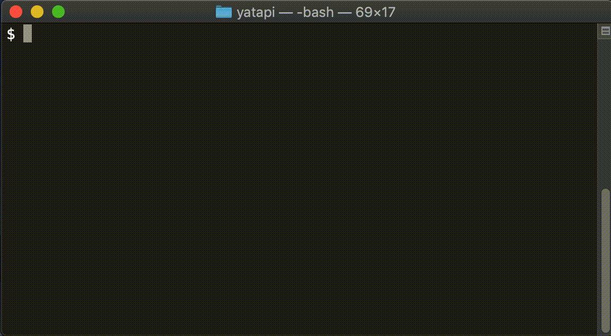

# yatapi
Yet Another Trigger API (YATAPI) is a Python based generator of SCMDraft TrigEdit triggers featuring **type annotations**, **autocompletion** (with a Python IDE) **one-to-one correspondence with TrigEdit triggers**, and **object oriented programming design**.  YATAPI is designed to work with [PyCharm](https://www.jetbrains.com/pycharm/download/#section=mac), a modern Python IDE, and requires only basic Python scripting knowledge and how Starcraft Triggers work.  YATAPI is minimalist and extensible, and can be used as the base for more advanced triggering.  Since YATAPI is a **whitebox**--it has a one-to-one correspondence with Starcraft Triggers, there is no need to learn a new specialized triggering language or framework.  

## Requirements

### System Requirements

* Python 3.6.x.  Recommended to use [miniconda](https://docs.conda.io/en/latest/miniconda.html) to manage Python virtual environments or similar tools.  miniconda will also install Python if not already on your system.
* [PyCharm IDE](https://www.jetbrains.com/pycharm/download/).  PyCharm community edition is available for free and takes full advantage of YATAPI's type annotations for creating easy to verify triggers.  
* [SCMDraft 2.0](http://www.stormcoast-fortress.net/cntt/software/scmdraft/download/).  This version has TrigEdit built in, which allows for creating triggers via text.

### Technical Requirements

* Basic command line usage familiarity (macOS Terminal or Windows command prompt)
* [Basic knowledge of Python scripting](https://www.python.org/about/gettingstarted/).  
* Knowledge of how Starcraft triggers work (i.e. you have made a custom map before).
* Understanding the difference between [value and reference semantics](https://stackoverflow.com/questions/373419/whats-the-difference-between-passing-by-reference-vs-passing-by-value)


## Installation

This assumes your system has met all [Technical Requirements](#technical-requirements).




1.  Clone or download this repository to your local machine, e.g. run `git clone https://github.com/sethmachine/yatapi.git` in your terminal or use the "Download Zip" option if you do not have a git client installed.

2.  (optional) Create and activate a Python virtual environment for your project:
    * With miniconda: `conda create --name my-project python=3.6`
    * Activate before installing: `source activate my-project`.  On Windows use `activate my-project`.  

3.  Install YATAPI using `pip` (included with modern Python installations):
    ```bash
    # assuming you cloned yatapi to your desktop
    $ cd ~/desktop/yatapi
    # (optional) use a virtual environment you created in step 2 before installing
    # note use `activate my-project` if using Windows
    # this will prepend the virtual environment name to the terminal prompt
    $ source activate my-project
    (my-project) $ pip install src/
    ```

4.  Verify YATAPI is installed: `python -c "import yatapi; print(yatap.__file__);"`.  Output should look like this: "/Users/sethmachine/miniconda3/envs/yatapi-examples/lib/python3.6/site-packages/yatapi/\_\_init\_\_.py".  If there is an error, the output will look like this: "ModuleNotFoundError: No module named 'yatapi'".  
